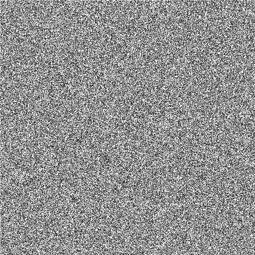
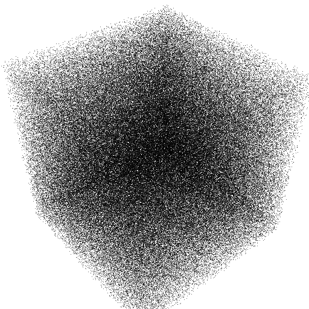
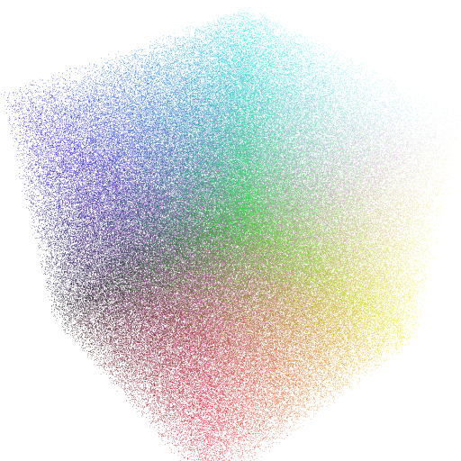

# Zero dimension

!!! example ""

    { align=left width=20% style="clear: both;"}
    ## Pixels (2D) { style="margin: 0; line-height: 1.0; " }

    This example show the Pixels visual where pixels are spread randomly inside
    a square that can be zoomed using the mouse and an orthographic camera.
    
    **:octicons-light-bulb-16: Keyword**: pixels, matplotlib, orthographic  
    **:simple-github: Code**: [pixels-2d.py](#)

!!! example ""

    { align=left width=20% style="clear: both;"}
    ## Pixels (3D) { style="margin: 0; line-height: 1.0; " }

    This example show the Pixels visual where pixels are spread randomly inside a cube that
    can be rotated and zoomed using the mouse and a perspective camera

    **:octicons-light-bulb-16: Keyword**: pixels, matplotlib, perspective  
    **:simple-github: Code**: [pixels-3d.py](#)
    
!!! example ""

    { align=left width=20% style="clear: both;"}
    ## Pixels (colors) { style="margin: 0; line-height: 1.0; " }

    This example show the Pixels visual where pixels are spread randomly inside a cube
    and colored according to their position. It is rather slow because it uses the
    matplotlib backend.

    **:octicons-light-bulb-16: Keyword**: pixels, matplotlib, colors, perspective  
    **:simple-github: Code**: [pixels-colors.py](#)
