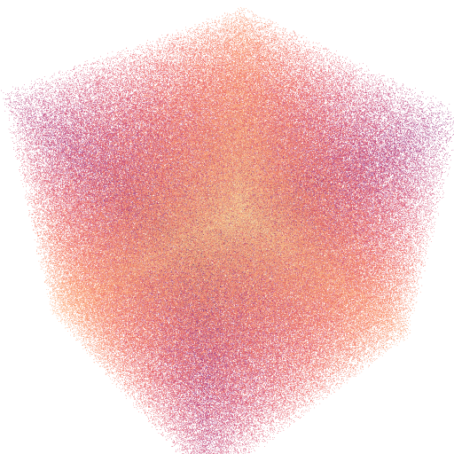
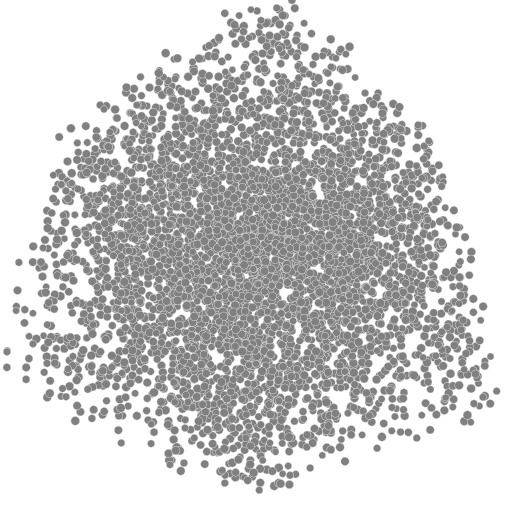
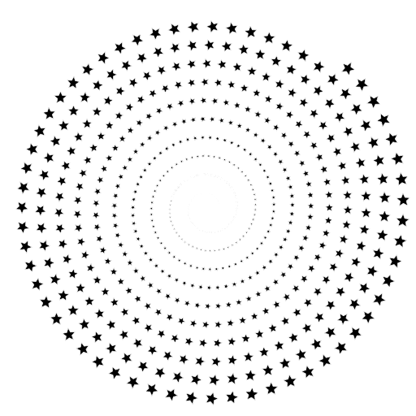
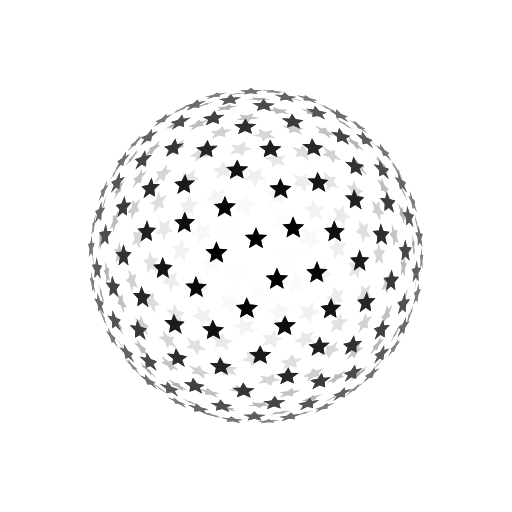

# Pixels, Points and Markers

## Pixels

!!! example ""

    { align=left width=20% style="clear: both;"}
    ### Pixels (2D) { style="margin: 0; line-height: 1.0; " }

    This example shows the Pixels visual where pixels are spread randomly inside
    a square that can be zoomed using the mouse and an orthographic camera.
    
    **:octicons-light-bulb-16: Keyword**: pixels, matplotlib, orthographic  
    **:simple-github: Code**: [pixels-2d.py](https://github.com/vispy/GSP/blob/master/examples/pixels-2d.py)

    ---

    { align=left width=20% style="clear: both;"}
    ### Pixels (3D) { style="margin: 0; line-height: 1.0; " }

    This example show the Pixels visual where pixels are spread randomly inside a cube that
    can be rotated and zoomed using the mouse and a perspective camera

    **:octicons-light-bulb-16: Keyword**: pixels, matplotlib, perspective  
    **:simple-github: Code**: [pixels-3d.py](https://github.com/vispy/GSP/blob/master/examples/pixels-3d.py)
    
    ---

    { align=left width=20% style="clear: both;"}
    ### Pixels (colors) { style="margin: 0; line-height: 1.0; " }

    This example show the Pixels visual where pixels are spread randomly inside a cube
    and colored according to their position.

    **:octicons-light-bulb-16: Keyword**: pixels, colors  
    **:simple-github: Code**: [pixels-colors.py](https://github.com/vispy/GSP/blob/master/examples/pixels-colors.py)

    ---

    { align=left width=20% style="clear: both;"}
    ### Pixels (colormap) { style="margin: 0; line-height: 1.0; " }

    This example shows the Pixels visual where pixels are colored according to
    screen coordinates (x,y) or depth (z) using a colormap.

    **:octicons-light-bulb-16: Keyword**: pixels, colormap, transform, screen  
    **:simple-github: Code**: [pixels-colormap.py](https://github.com/vispy/GSP/blob/master/examples/pixels-colormap.py)

## Points

!!! example ""

    { align=left width=20% style="clear: both;"}
    ### Points (2D) { style="margin: 0; line-height: 1.0; " }

    This example shows the Points visual with different sizes can be zoomed
    using the mouse and an orthographic camera.

    **:octicons-light-bulb-16: Keyword**: points, matplotlib, orthographic  
    **:simple-github: Code**: [points-3d.py](https://github.com/vispy/GSP/blob/master/examples/points-2d.py)

    ---

    { align=left width=20% style="clear: both;"}
    ### Points (3D) { style="margin: 0; line-height: 1.0; " }

    This example shows the Points visual with different sizes can be
    roated and zoomed using the mouse and a perspective camera. Points
    size and linewidth are updated according to zoom level.

    **:octicons-light-bulb-16: Keyword**: points, matplotlib, perspective, zoom  
    **:simple-github: Code**: [points-3d.py](https://github.com/vispy/GSP/blob/master/examples/points-3d.py)

    ---

    { align=left width=20% style="clear: both;"}
    ### Points (Colormap) { style="margin: 0; line-height: 1.0; " }

    This example shows the Points visual where point colors are set
    according to their depth (screen coordinate) and a colormap (magma).
    This results in dynamic colors where most front points are alwyas
    painted with the same color.

    **:octicons-light-bulb-16: Keyword**: points, matplotlib, transform, colormap  
    **:simple-github: Code**: [points-colormap.py](https://github.com/vispy/GSP/blob/master/examples/points-colormap.py)

## Markers

!!! example ""

    { align=left width=20% style="clear: both;"}
    ### Markers (2D) { style="margin: 0; line-height: 1.0; " }

    This example shows the Markers visual with different sizes and angles and can
    be zoomed using the mouse and an orthographic camera.

    **:octicons-light-bulb-16: Keyword**: markers, matplotlib, orthographic  
    **:simple-github: Code**: [markers-2d.py](https://github.com/vispy/GSP/blob/master/examples/markers-2d.py)

    ---

    { align=left width=20% style="clear: both;"}
    ### Markers (3D) { style="margin: 0; line-height: 1.0; " }

    This example shows the Markers visual with different sizes and angles and can
    be zoomed using the mouse and a perspecive camera.

    **:octicons-light-bulb-16: Keyword**: markers, matplotlib, orthographic  
    **:simple-github: Code**: [markers-3d.py](https://github.com/vispy/GSP/blob/master/examples/markers-3d.py)
